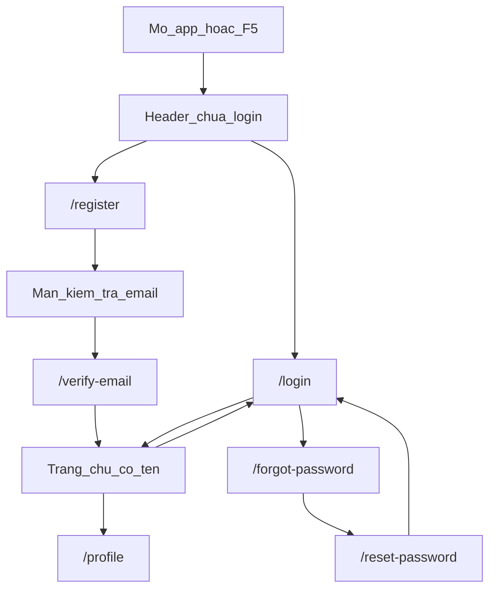

# 12. Luồng Auth theo giao diện (bấm nút nào thì chuyện gì)

Đọc tài liệu này **khi đang mở app** `http://localhost:5173`. Mỗi mục = một việc bạn làm trên màn hình.

Không dán source. Mở file trong repo, đọc comment phía trên hàm.

Bản `docx`: `docx/LUONG_AUTH_THEO_GIAO_DIEN.md`.

Tài khoản seed (đã xác nhận email, login được ngay):

| Email | Mật khẩu |
| :--- | :--- |
| `student@elearning.com` | `Student123456` |
| `teacher@elearning.com` | `Teacher123456` |
| `admin@elearning.com` | `Admin123456` |



---

## 1. Mở app / nhấn F5

**Trên UI:** vừa vào `http://localhost:5173`, chưa bấm gì. Header có thể hiện “Đăng Nhập” hoặc tên user.

**Ví dụ:** đã login trước đó, F5 lại.

**Luồng:**

```text
App vừa load
  → GET /api/v1/auth/me  (cookie accessToken tự đi kèm)
  → có cookie hợp lệ + user còn active
       → JSON { user } → Header hiện tên
  → không cookie / hết hạn / 401
       → user = null → nút Đăng Nhập, Đăng Ký
```

**File:** `frontend/src/App.jsx` (`checkAuth`) → `auth.middleware.js` (`authenticate`) → `auth.controller.js` (`getProfile`).

**Thấy gì:** Network tab request `/auth/me`. Không thấy JWT trong `localStorage`.

---

## 2. Header: Đăng Nhập / Đăng Ký

**Trên UI:** góc phải, khi chưa login.

**Luồng:** chỉ đổi URL, **chưa gọi API**.

```text
Bấm Đăng Nhập  → /login
Bấm Đăng Ký    → /register
```

**File:** `frontend/src/components/common/Header.jsx`.

---

## 3. Đăng ký form (`/register`)

**Trên UI:** họ tên, email, mật khẩu, chọn Học sinh / Giáo viên, bấm **Đăng Ký Tài Khoản**.

**Ví dụ:** email **mới** (chưa có trong DB). Đừng dùng `student@elearning.com` — email đó đã tồn tại.

**Luồng:**

```text
Bấm Đăng Ký
  → POST /api/v1/auth/register { fullName, email, password, role }
  → hash mật khẩu, user emailVerified=false
  → gửi mail (link /verify-email?token=...)
  → KHÔNG set cookie
  → màn hình "Kiểm tra email của bạn"
```

**File:** `RegisterPage.jsx` (`handleSubmit`) → `auth.controller.js` (`register`) → `auth.service.js` (`register`, `createAndSendEmailToken`) → `mail.service.js`.

**Thấy gì:** DevTools Cookies **chưa** có `accessToken`. Inbox (hoặc log `[MAIL:link]` trên terminal backend) có link. Header vẫn “Đăng Nhập” — **chưa vào hệ thống**.

---

## 4. Bấm link trong email (`/verify-email?token=`)

**Trên UI:** mở mail “Xác nhận email đăng ký tài khoản ETech” → bấm nút / dán URL. Trang tự chạy, không cần form.

**Luồng:**

```text
Mở /verify-email?token=RAW
  → POST /api/v1/auth/verify-email { token }
  → hash token khớp DB, usedAt = now, emailVerified=true
  → set cookie + JSON { user }
  → vào trang chủ, Header hiện tên
```

**File:** `VerifyEmailPage.jsx` → `auth.controller.js` (`verifyEmail`) → `auth.service.js` (`consumeEmailToken`, `verifyEmail`).

**Thấy gì:** cookie `accessToken` + `refreshToken`. Bấm link lần 2 → lỗi token đã dùng.

---

## 5. Đăng nhập mật khẩu (`/login`)

**Trên UI:** form Email + Mật khẩu, bấm **Đăng Nhập**.

**Ví dụ:** `student@elearning.com` / `Student123456`.

**Luồng:**

```text
/login → điền seed → bấm Đăng Nhập
  → POST /api/v1/auth/login { email, password }
  → bcrypt.compare + issueTokenPair
  → Set-Cookie accessToken, refreshToken
  → JSON { user }  (không có JWT trong body)
  → App setUser → trang chủ, Header hiện tên
```

**File:** `LoginPage.jsx` (`handleSubmit`) → `auth.schema.js` (`loginSchema`) → `auth.controller.js` (`login`) → `auth.service.js` (`login`, `issueTokenPair`) → `cookie.util.js` (`setAuthCookies`).

**Thấy gì:** Application → Cookies: hai cookie `httpOnly`. F5 vẫn còn tên (mục 1).

Sai mật khẩu → JSON 401, không cookie mới.

---

## 6. Login khi chưa xác nhận email

**Trên UI:** `/login` với email vừa đăng ký (mục 3) **trước khi** bấm link mail.

**Luồng:**

```text
POST /login
  → mật khẩu đúng nhưng emailVerified=false
  → 403, code EMAIL_NOT_VERIFIED
  → hiện chữ đỏ + dòng "gửi lại email"
Bấm "Gửi lại email xác nhận"
  → POST /api/v1/auth/resend-verification { email }
  → luôn câu trả lời chung (không lộ email có tồn tại)
```

**File:** `LoginPage.jsx` (`handleSubmit`, `handleResend`) → `auth.service.js` (`login`, `resendVerification`).

**Thấy gì:** nút gửi lại **chỉ hiện** khi vừa bị lỗi chưa verify. Mail mới (token cũ bị vô hiệu).

---

## 7. Nút Google (trang Login và Register)

**Trên UI:** khối “Hoặc tiếp tục với” + nút Google (ẩn nếu thiếu `VITE_GOOGLE_CLIENT_ID`).

**Ví dụ:** Gmail đã thêm Test user trên Google Cloud. Không cần đăng ký form trước.

**Luồng:**

```text
Bấm nút Google → chọn Gmail trên popup Google
  → GIS trả idToken
  → POST /api/v1/auth/google { idToken }
  → verifyIdToken, tạo user hoặc gắn googleId vào email LOCAL
  → Set-Cookie (giống login mật khẩu)
  → vào trang chủ
```

**File:** `GoogleLoginButton.jsx` (`handleCredential`) → `auth.controller.js` (`googleLogin`) → `googleAuth.service.js` → `auth.service.js` (`loginWithGoogle`).

**Thấy gì:** cookie như mục 5. `users.provider` có thể là `GOOGLE`, `emailVerified=true`. Cấu hình Console: `docs/10-huong-dan-oauth-google.md`.

---

## 8. Quên mật khẩu (`/forgot-password`)

**Trên UI:** `/login` → link **Quên mật khẩu?** → nhập email → gửi.

**Ví dụ:** `student@elearning.com`.

**Luồng:**

```text
POST /api/v1/auth/forgot-password { email }
  → luôn hiện thành công trên UI
  → chỉ gửi mail nếu user LOCAL, còn active, có password
  → link /reset-password?token=
```

**File:** `ForgotPasswordPage.jsx` → `auth.service.js` (`forgotPassword`).

**Thấy gì:** không báo “email không tồn tại” (tránh dò tài khoản). Google-only (không mật khẩu) thì không có mail reset.

---

## 9. Link đặt lại mật khẩu (`/reset-password?token=`)

**Trên UI:** mail “Đặt lại mật khẩu” → form mật khẩu mới + xác nhận.

**Luồng:**

```text
POST /api/v1/auth/reset-password { token, newPassword }
  → consume token, hash MK mới
  → revoke mọi refresh (đá hết phiên)
  → xóa cookie trình duyệt
  → mail cảnh báo đã đổi
  → về /login, phải đăng nhập lại
```

**File:** `ResetPasswordPage.jsx` → `auth.controller.js` (`resetPassword`) → `auth.service.js` (`resetPassword`).

**Thấy gì:** cookie biến mất. Login bằng **mật khẩu mới**.

---

## 10. Đổi mật khẩu (`/profile`)

**Trên UI:** đã login → Header bấm **tên** → `/profile` → mật khẩu hiện tại + mật khẩu mới.

**Luồng:**

```text
POST /api/v1/auth/change-password { currentPassword, newPassword }
  → cần cookie (authenticate)
  → bcrypt mật khẩu cũ
  → revoke mọi refresh, cấp cookie mới
  → mail "mật khẩu vừa được thay đổi"
  → vẫn ở /profile, dòng thành công
```

**File:** `ProfilePage.jsx` → `auth.controller.js` (`changePassword`). Tài khoản chỉ Google, chưa có password → API báo dùng quên mật khẩu để tạo MK.

**Thấy gì:** vẫn login (cookie mới). Inbox có mail cảnh báo bảo mật.

---

## 11. Đăng xuất (Header)

**Trên UI:** đã login → icon đăng xuất cạnh tên.

**Luồng:**

```text
Bấm đăng xuất
  → POST /api/v1/auth/logout
  → revoke refresh token trên DB
  → xóa cookie access + refresh
  → App user = null → Header lại Đăng Nhập
```

**File:** `Header.jsx` (`onLogout`) → `App.jsx` (`handleLogout`) → `auth.controller.js` (`logout`).

**Thấy gì:** Cookies trống. F5 không tự vào lại.

---

## 12. Access hết hạn (không có nút)

**Trên UI:** bạn không bấm gì đặc biệt. Mở DevTools → Network khi đang dùng app lâu (~15 phút, hoặc sau khi tạm set `JWT_EXPIRES_IN=10s`).

**Luồng:**

```text
GET /auth/me (hoặc API khác) → 401 access hết hạn
  → axios interceptor
  → POST /api/v1/auth/refresh-token  (cookie refresh)
  → token refresh cũ revokedAt, cấp cặp mới, Set-Cookie
  → gọi lại request vừa fail
```

**File:** `frontend/src/lib/axios.js` → `auth.service.js` (`refreshToken`).

**Thấy gì:** hai request liên tiếp: 401 rồi 200. Login / register **không** đi nhánh này (`AUTH_SKIP_REFRESH`).

---

## Bảng nhanh: nút → API

| Bạn làm trên UI | API |
| :--- | :--- |
| F5 / mở app | `GET /auth/me` |
| Header Đăng nhập / Đăng ký | không API |
| Đăng Ký Tài Khoản | `POST /auth/register` |
| Bấm link mail xác nhận | `POST /auth/verify-email` |
| Đăng Nhập (mật khẩu) | `POST /auth/login` |
| Gửi lại email xác nhận | `POST /auth/resend-verification` |
| Nút Google | `POST /auth/google` |
| Quên mật khẩu | `POST /auth/forgot-password` |
| Đặt mật khẩu mới từ mail | `POST /auth/reset-password` |
| Đổi mật khẩu trên Profile | `POST /auth/change-password` |
| Icon đăng xuất | `POST /auth/logout` |
| (ẩn) access hết hạn | `POST /auth/refresh-token` |

Prefix đầy đủ: `/api/v1`.

Học theo buổi (file nào đọc trước): `docs/11-lo-trinh-hoc-auth.md`.  
Từ điển JWT / cookie: `docs/09-giai-thich-code-auth.md`.
